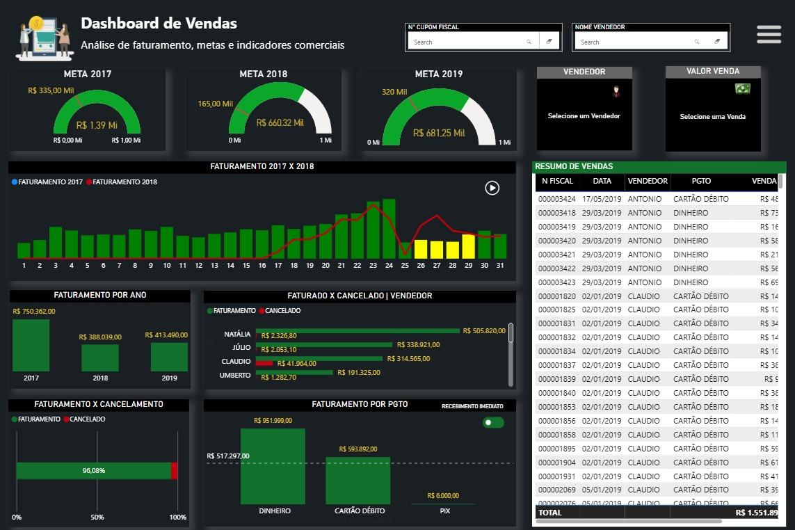

# Relatório de Vendas – Power BI

Este repositório contém um dashboard de vendas desenvolvido em **Power BI**, com foco em:

- Faturamento anual  
- Meta x Realizado  
- Formas de pagamento (dinheiro, crédito, débito e pix)  
- Faturamento x cancelamento  
- Resumo por cartões  
- Desempenho por vendedor e por campus  

---

## 🖼️ Layout do Dashboard

### **Capa**

### **Página 1 – Visão Geral de Vendas**

---

## 📊 Arquivo do Power BI

- Arquivo principal: `controle_de_vendas.pbix`

### **Como abrir**

> 🔎 Observação: o GitHub não permite visualizar arquivos .PBIX na web.
> Para abrir o relatório, faça o download e abra no Power BI Desktop.

> ⚠️ Os dados utilizados foram ajustados para fins de estudo (portfólio).  
> Nenhuma informação sensível é exposta neste repositório.

---

## 🎯 Objetivo do Projeto

- Treinar construção de dashboards  
- Criar um projeto para **portfólio**  
- Explorar:
  - Medidas DAX básicas  
  - Segmentações diversas  
  - Análises comparativas (ano, vendedor, campus, pagamento)  
  - Visualização de metas e desempenho  

---

## 🛠️ Tecnologias Utilizadas

- **Power BI Desktop**
- **Power Query (ETL)**  
  - Limpeza  
  - Transformações  
  - Colunas calculadas  
  - Normalização dos dados  
- **PowerPoint** (capa)

---

## 👩🏾‍💻 Autora

**Clarisse Maurila** – Analista de Dados  
🔗 LinkedIn: https://www.linkedin.com/in/clarissemaurila-dados/

